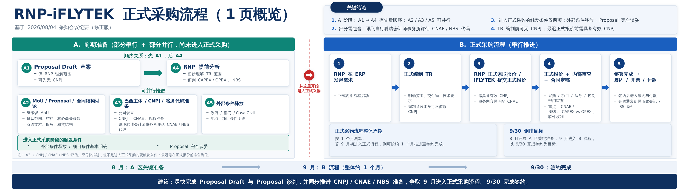

# RNP-iFLYTEK 采购流程 · 32:9 单页 PPT

一页 32:9 幻灯片（20″ × 5.625″），概览 RNP-iFLYTEK 正式采购流程，内容来自 2026/08/04 采购会议纪要（修正版）。



## 文件

| 路径 | 说明 |
|---|---|
| `RNP-iFLYTEK-采购流程-32x9.pptx` | 成品幻灯片 |
| `build_deck.js` | 生成脚本（pptxgenjs），改文案后重跑即可 |
| `preview-32x9.png` | 150 dpi 预览图 |
| `scripts/qa.sh` | 构建 + 校验 + 内容核对 + 渲染 |
| `scripts/render.sh` | 只渲染预览图 |

## 用法

```bash
npm install
npm run build      # 生成 pptx
npm run qa         # 构建 + 校验 + 渲染预览
npm run preview    # 只重新渲染 preview-32x9.png
```

改内容直接编辑 `build_deck.js` 里的数据数组（`concl`、`parCards`、`steps`），坐标都是英寸。

## 版面

左区 A 为尚未进入正式采购的前期准备：A1 Proposal Draft 先行、A4 RNP 提前分析随后，A2 / A3 / A5 三线并行。红色虚线右侧是 B 区五步串行的正式采购流程。进入正式采购的硬触发条件只有两项：外部条件释放、Proposal 完全谈妥。

图中「A4」「A5」两个编号是按会议纪要的表述补上的——原图这两个方框没有编号，但结论里写了「A1 → A4」「A2 / A3 / A5 可并行」。

## 环境依赖

`.claude/hooks/session-start.sh` 会在 Claude Code web 会话启动时自动装好下列依赖；本地跑需要自己准备：

- **Node** — `pptxgenjs`
- **Python** — `defusedxml` `lxml` `Pillow` `pymupdf` `markitdown[pptx]`
- **LibreOffice Impress** — 渲染预览用。注意 `libreoffice-core` **不含** Impress 过滤器，缺了它转换会报 `source file could not be loaded`，需要单独装 `libreoffice-impress`
- **中文字体** — 如 `fonts-wqy-zenhei`，否则预览图里中文是方块

幻灯片里指定的字体是 **Microsoft YaHei**。LibreOffice 没有这个字体，渲染预览时会替换成文泉驿正黑，字宽略有差异，所以预览图的排版比实际 PowerPoint 中稍松一点。
